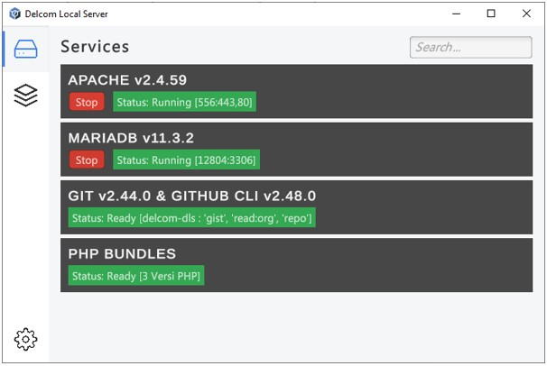
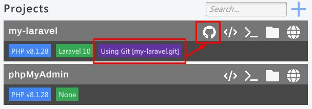

# Delcom Local Server (DLS) Guide

## Requirements

DLS menggunakan berbagai macam tools yang dibutuhkan untuk dapat membuat server lokal. Dalam DLS terdapat dua istilah yang digunakan untuk merujuk tools yaitu service dan program. Service merujuk pada layanan atau sistem yang berjalan untuk mengerjakan tugas tertentu yang umumnya berjalan di belakang layar. Program merujuk pada aplikasi yang digunakan untuk membantu memudahkan mengerjakan tugas tertentu yang umumnya berjalan pada tampilan GUI (Graphical User Interface). 

**Important** (Wajib)

- Bundles

  > **Services [12-05-2024]** : [[Download Bundles](https://drive.google.com/drive/folders/1JiNJwDrgTWzCMgajZdIXN9VpBxml2jZH?usp=drive_link)]
  >
  > - Apache v2.4.59
  > - MariaDB v11.3.2
  > - Git v2.44.0
  > - Git CLI v2.48.0
  > - PHP Bundles (v8.3.7, v8.2.19, v8.1.28)

- Separated

  > - Apache : [[Download](https://www.apachelounge.com/download/)]
  > - Git Portable : [[Download](https://git-scm.com/download/win)]
  > - Github CLI : [[Download](https://cli.github.com/)]
  > - MariaDB : [[Download](https://mariadb.org/download/)]
  > - PHP : [[Download](https://www.php.net/downloads.php)]

**Optional** (Opsional)

- Programs

  > - Visual Studio Code : [[Download](https://code.visualstudio.com/download)]
  > - Github Desktop : [[Download](https://desktop.github.com/)]

## Setup DLS

1. Saat pertama kali membuka program DLS akan tampil dialog License Key. Pada bagian isian `Enter Keys...`  silahkan isi dengan lisensi sesuai id program DLS kamu.

	

2. Jika belum mengatur lokasi services akan berada pada tampilan Settings. Pada jendela ini di bagian `Service Location` silahkan isi dengan lokasi services yang telah kamu download sebelumnya pada bagian `requirements`. Jika lokasi services valid maka akan tampil ikon save. Pilih pada ikon tersebut untuk menyimpan lokasi services dan DLS akan melakukan setup secara otomatis.

	

3. Jika tampil dialog berikut. Pilih sesuai opsi berikut agar fitur-fitur pada service apache dapat berjalan dengan baik. Service Apache digunakan untuk membuat web server agar mampu menjalankan aplikasi-aplikasi web.

	

4. Jika berhasil maka akan berada pada tampilan Services. Pada tampilan ini akan terdapat service Apache, MariaDB, Git & Github CLI dan PHP yang diperlukan untuk menjalankan proyek aplikasi web. Jika diperhatikan untuk Git & Github CLI belum ready karena belum melakukan konfigurasi `Github Token` pada tampilan Settings. Silahkan buka kembali tampilan Settings dengan memilih ikon berikut:

	

5. Jika belum memiliki akun Github silahkan [[Mendaftar Akun Github](github/register.md)] terlebih dahulu. Jika sudah memiliki akun silahkan [[Membuat Token Github](github/token.md)] terlebih dahulu. Jika sudah memiliki Github Token silahkan salin dan masukkan ke bagian isian `Github Token` pada DLS. Jika valid maka akan tampil ikon save. Pilih pada tombol save tersebut untuk melakukan setup secara otomatis.

	

6. Buka kembali tampilan Services. Jika berhasil maka pada tampilan ini status untuk services Git & Github CLI menjadi Ready. Jika diperhatikan pada status Apache dan MariaDB masih `stop` artinya service belum berjalan. Silahkan pilih tombol `start` pada services Apache dan MariaDB untuk menjalankan services.

	

7. Jika berhasil maka status untuk services Apache dan MariaDB telah berubah menjadi Running.

	

8. Selanjutnya buka tampilan Projects seperti berikut. Selanjutnya jika mendownload services bundles pada bagian `requirements` maka akan terdapat satu proyek yang telah disediakan yaitu `phpMyAdmin` untuk melakukan manage database pada halaman web. Pada proyek ini pilih ikon Globe untuk membuka tampilan proyek pada halaman web di web browser.

	

9. Jika berhasil maka pada web browser akan tampil halaman web dari proyek phpMyAdmin. Silahkan login dengan mengisi `root` pada bagian `Username`. Setelah itu pilih tombol `Log In`.

	

10. Jika berhasil login maka akan berada pada tampilan manage database menggunakan phpMyAdmin. Selamat kamu telah berhasil melakukan setup DLS.

	

## Create Projects

Pada DLS kamu dapat membuat proyek web baru dengan memilih ikon plus pada sudut kanan atas di tampilan Projects DLS.

Akan tampil dialog untuk membuat proyek web baru, seperti berikut:

- Pada opsi `Source` terdapat 3 pilihan, yaitu:
  1) `None` : Membuat proyek web dari awal.
  2) `Local`: Membuat proyek web dari proyek yang sudah ada dan tersimpan di komputer lokal saat ini.
  3) `Github`: Membuat proyek web dari repository Github.

- Pada bagian isian `Project Name` silahkan masukkan nama proyek tanpa menggunakan karakter sepesial kecuali (`-`) simbol setrip dan (`_`) simbol underscode. Contoh nama yang valid:
  1) sample-projects
  2) sample_projects
  3) sampleProjects
  4) sampleProjects2

- Pada opsi `Technology` silahkan memilih sesuai dengan kebutuhan.
- Opsi `Technology Version` akan tampil jika opsi `Technology` yang dipilih bukan `None`. Silahkan juga pilih opsi sesuai dengan kebutuhan.
- Opsi `Framework` akan tampil  jika opsi `Technology` yang dipilih bukan `None`. Silahkan juga pilih opsi sesuai dengan kebutuhan.
- Opsi `Service Database` akan tampil  jika opsi `Framework` yang dipilih adalah `Laravel`. Silahkan juga pilih opsi sesuai dengan kebutuhan.
- Isian `Database Name` akan tampil jika opsi `Service Database` yang dipilih bukan `None`. Silahkan isi nama database sesuai dengan aturan penamaan `Project Name` yang valid.
- Jika telah selesai memilih pengaturan proyek baru selanjutnya pilih tombol `Create` untuk membuat proyek web baru.
- Tunggu sampai proses pembuatan proyek selesai, umumnya membutuhkan waktu 1 sampai 10 menit.

Jika proyek berhasil dibuat maka akan tampil pada tampilan Projects. Jika diperhatikan pada setiap proyek terdapat 4 ikon umum yang tampil, yaitu:

1) `Code`: Untuk membuka proyek pada Text Editor `Visual Studio Code`.
2) `Terminal`: Untuk membuka lokasi proyek pada Terminal Windows.
3) `Folder`: Untuk membuka lokasi proyek pada File Explorer Windows.
4) `Globe`: Untuk membuka proyek pada web browser.

Berikut merupakan tampilan dari proyek `my-laravel` saat ikon `Globe` dipilih:

## Share Projects on Github

Pada DLS kamu dapat menghubungkan proyek kamu ke repository Github. Seperti berikut:

1. Silahkan tentukan proyek yang akan dikirimkan ke Github dalam kasus ini menggunakan proyek `my-laravel`. Jika proyek tersebut belum mengimplementasikan Git maka akan tampil tombol `git init`. Silahkan pilih pada tombol tersebut agar proyek mengimplementasikan Git.

	

2. Jika berhasil maka akan tampil label untuk menginformasikan bahwa proyek telah mengimplementasikan Git, tetapi terdapat informasi tambahan di dalam kurung siku yaitu `Not Remote` yang berarti proyek ini belum terhubung ke repository Github. Pada bagian ini akan tampil tombol `share on github`, silahkan pilih pada tombol tersebut untuk menghubungkan proyek dengan repository Github.

	

3. Akan tampil dialog untuk menentukan nama repository pada Github. Silahkan sesuaikan saja dengan `Project Name`. Pada opsi Visibility terdapat 2 opsi, yaitu: Public (untuk membuat repository Github yang dapat diakses oleh semua orang) dan Private (untuk membuat repository Github yang hanya dapat diakses oleh pengguna yang kamu beri izin). Jika telah selesai melakukan pengaturan, selanjutnya pilih tombol `Create` untuk menghubungkan proyek dengan repository Github.

	

4. Jika berhasil menghubungkan proyek dengan Repository Github maka pada label `Using Git` sekarang nilainya telah berubah dari `Not Remote` menjadi nama `Repository Github`. Juga apabila proyek telah terhubung ke Github maka akan tampil ikon `Github` disudut kanan atas untuk membuka proyek menggunakan `Github Desktop` sehingga memudahkan update repository jika terdapat perubahan kode program.

	

5. Jika tahapan yang dilakukan benar maka pada akun GIthub akan terdapat repository yang telah terhubung ke salah satu proyek pada DLS.

	

## Templates

Kamu dapat menggunakan daftar URL repositori berikut untuk memberikan referensi terkait proyek yang akan dibuat: [[Templates](templates.md)]
