# Mendaftar Akun Github

1. Buka website pendaftaran Github dengan mengunjungi URL berikut: https://github.com/signup

2. Pada halaman pendaftaran Github silahkan masukkan alamat email kamu. Setelah itu pilih tombol `Continue`.

	
   
3. Selanjutnya masukkan kata sandi untuk akun Github baru kamu (pastikan kata sandi yang digunakan kuat dengan melihat indikator pada bagian bawah). Setelah itu pilih tombol `Continue`.

	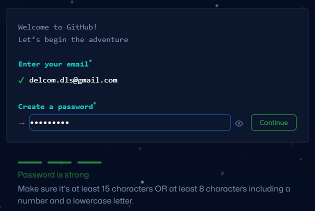
   
4. Selanjutnya masukkan username untuk akun Github kamu. Setelah itu pilih tombol `Continue`.

	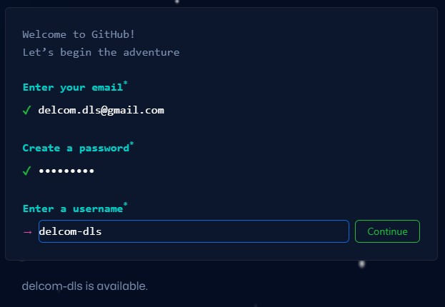
   
5. Selanjutnya akan tampil opsi `Email preferences` abaikan saja. Setelah itu pilih tombol `Continue`.

	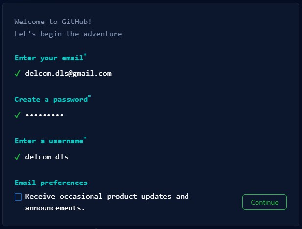
   
6. Selanjutnya akan tampil halaman `Verify your account`. Pada halaman ini pilih tombol `Verifikasi`.

	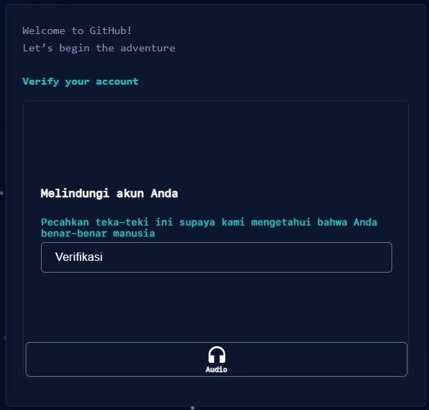
   
7. Selanjutnya kamu akan diminta untuk menyelesaikan teka-teki sesuai dengan arah yang ditunjuk oleh gambar di sebelah kiri. Silahkan pilih gambar dengan posisi yang benar pada gambar sebelah kanan untuk menyelesaikan teka-teki. Setelah itu pilih tombol `Kirim`.

	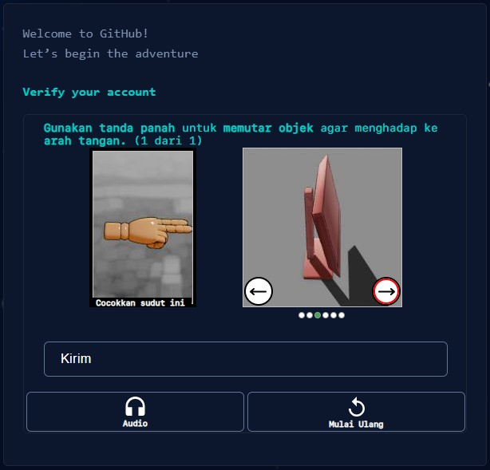
   
8. Jika berhasil menyelesaikan teka-teki maka akan tampil halaman berikut.

	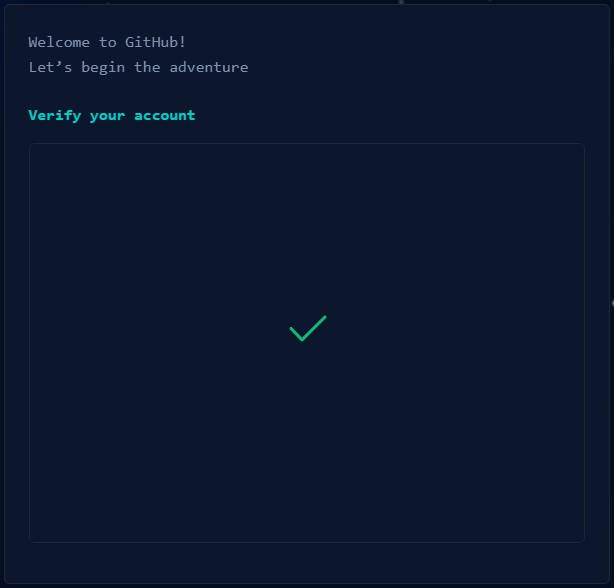
	
9. Selanjutnya kamu diminta untuk memasukan kode verifikasi yang telah dikirimkan ke alamat email yang digunakan saat melakukan pendaftaran sebelumnya.

	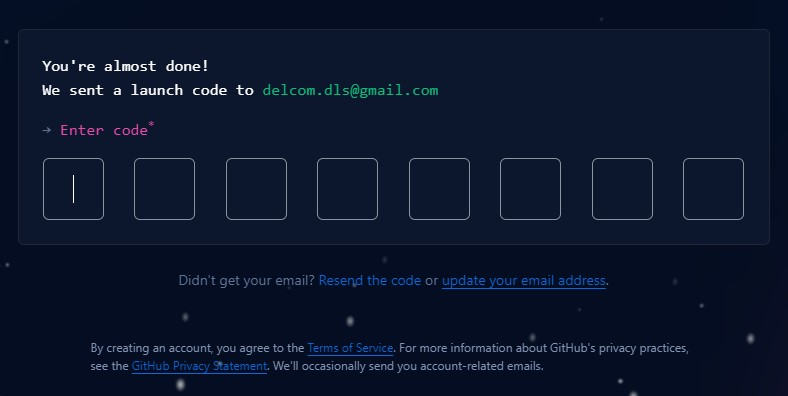
	
10. Berikut merupakan tampilan dari inbox email yang berisikan kode verifikasi akun Github. Silahkan salin kode verifikasi tersebut. Dalam kasus ini adalah `27978839` dan paste ke tahapan nomor 9.

	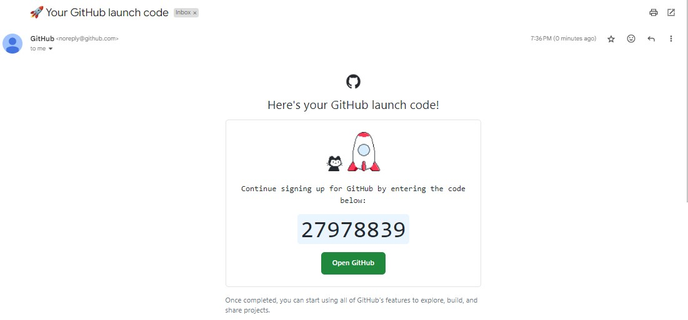

11. Setelah memasukan kode verifikasi dari email ke tahapan nomor 9 dengan benar, maka secara otomatis akan diarahkan ke halaman login akun Github.

	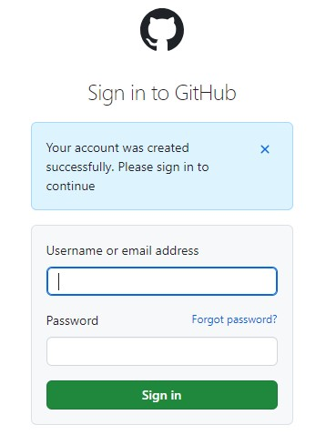
	
12. Silahkan login dengan akun Github yang telah kamu didaftarkan sebelumnya. Setelah itu pilih tombol `Sign In`.

	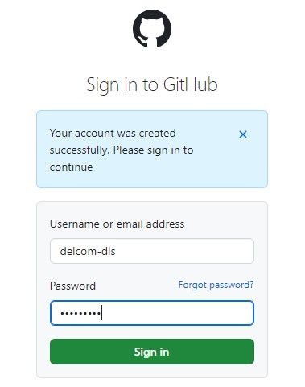
	
13. Saat pertama kali login menggunakan akun Github kamu akan diminta untuk menjawab beberapa pertanyaan. Silahkan pilih sesuai dengan kondisi kamu. Setelah itu pilih tombol `Continue`.

	
	
14. Pada tampilan berikutnya silahkan scrool sampai ke bagian bawah. Setelah itu pilih menu `Skip personalization`.

	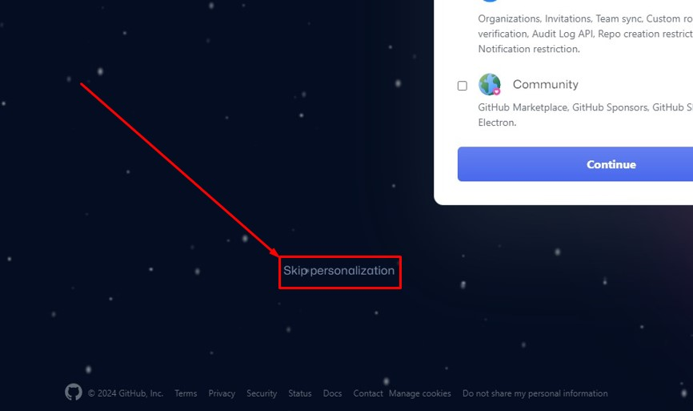
	
15. Jika telah selesai, selanjutnya kamu akan dialihkan kehalaman Home dari aplikasi web Github. Selamat kamu telah berhasil melakukan pendaftaran akun Github.

	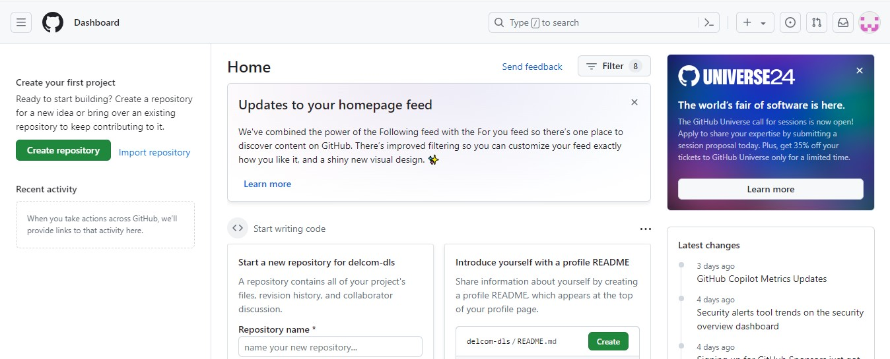
