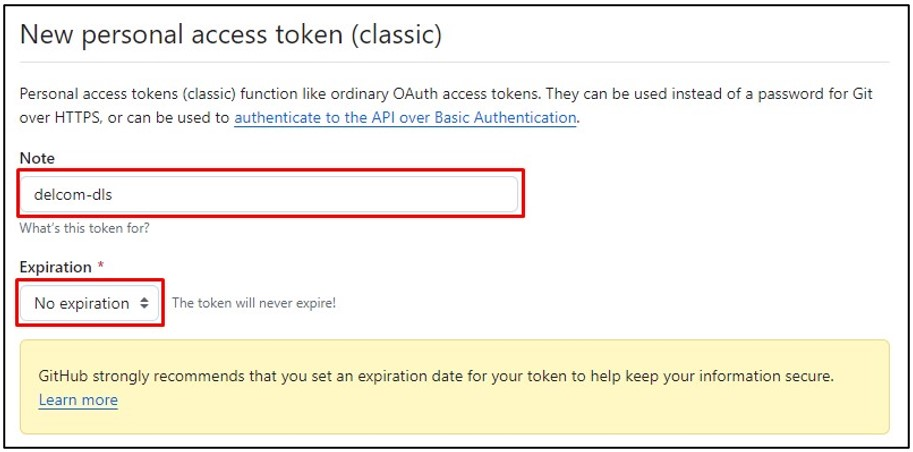

# Membuat Token Github

1. Pastikan sebelumnya kamu telah memiliki akun Github. Jika belum silahkan [[Mendaftar Akun Github](register.md)] terlebih dahulu.

2. Silahkan masuk ke akun Github kamu dengan mengunjungi situs berikut: https://github.com/login

3. Setelah berhasil login. Pada halaman Home silahkan pilih menu `profile`. 

	
  
4. Akan tampil daftar menu pada posisi sebelah kanan. Selanjutnya cari dan pilih pada menu `Settings`.

	
	
5. Akan tampil halaman `Settings` pada Github. Selanjutnya scrool ke bawah, kemudian cari dan pilih pada menu `Developer settings`.

	
	
6. Akan tampil halaman `Developer Settings` pada Github. Selanjutnya pilih menu `Personal access tokens > Tokens (classic)`. Pada tampilan sebelah kanan pilih opsi `Generate new token > Generate new token (classic)`.

	
	
7. Akan tampil halaman untuk membuat `access token (classic)`. Pada bagian `Note` silahkan isi sesuai dengan tujuan penggunaan token. Dalam kasus ini, bagian `Note` di isi dengan `delcom-dls` karena token akan digunakan untuk `Delcom Local Server (DLS)`. Pada bagian `Expiration` pilih `No expiration` agar tidak perlu memperbarui token secara berkala.

	
	
8. Scroll ke bawah sampai pada bagian `Select scopes`. Silahkan pilih pada opsi `repo`.

	

9. Scroll lagi ke bawah. Silihkan pilih pada opsi `read:org` dan `gist`.

	
	
10. Jika sudah yakin mencentang opsi pada scopes `repo`, `read:org` dan `gist`. Selanjutnya scroll ke bagian bawah dan pilih pada tombol `Generate token` untuk membuat token Github baru.

	
	
11. Jika berhasil kamu akan memperoleh token Github. Silahkan salin token tersebut dan simpan ditempat yang aman dikarenakan kamu tidak dapat melihatnya kembali setelah itu. Selamat kamu telah berhasil membuat token Github.

	
