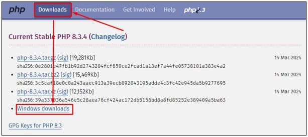
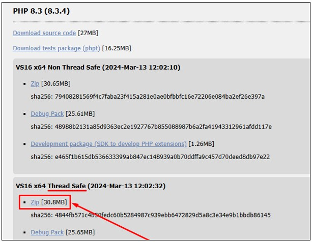
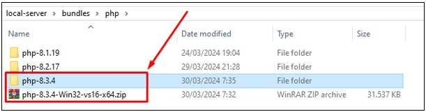
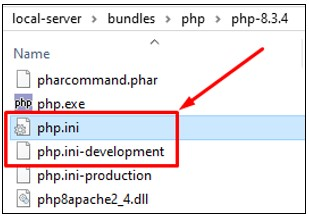
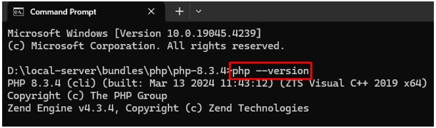
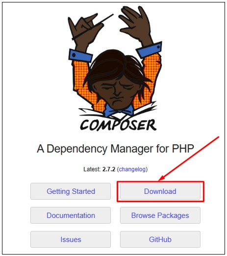
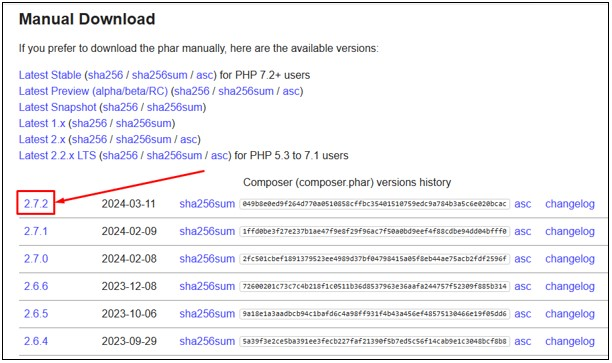
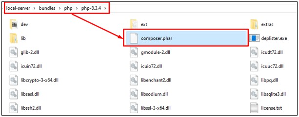
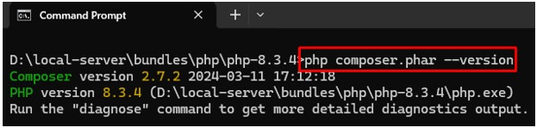

# PHP Manager

## A. PHP

PHP adalah singkatan dari Hypertext Preprocessor, yang merupakan bahasa pemrograman open-source yang paling umum digunakan untuk pengembangan situs web dinamis. PHP biasanya disematkan dalam kode HTML dan dieksekusi di server, menghasilkan konten web yang dapat disesuaikan secara dinamis. PHP dapat digunakan untuk berbagai macam tugas, mulai dari membuat halaman web sederhana hingga mengelola basis data, mengirim email, dan bahkan membangun aplikasi web yang kompleks. Keunggulan PHP termasuk kemudahan sintaksis, kompatibilitas yang luas dengan berbagai sistem operasi dan server web, serta adanya komunitas besar yang mendukung dengan banyaknya sumber daya dan framework.

- Situs Resmi: [https://www.php.net/](https://www.php.net/)

### 1. Instalasi PHP

- Silahkan download PHP dengan [membuka situs resminya](https://www.php.net/).  Selanjutnya pada bagian navbar pilih menu `Download`. Selanjutnya pilih pada opsi `Windows downloads`.

​	

- Pada halaman `Download` pilih pada bagian `Thread Safe`. Setelah itu pilih opsi `Zip` untuk mulai mengunduh PHP.

​	

- Setelah selesai mengunduh PHP silahkan pindahkan ke lokasi yang aman dan merupakan lokasi tempat semua versi PHP berada. Dalam kasus ini versi PHP yang diunduh adalah `php-8.3.4-Win32-vs16-x64.zip`.  Selanjutnya extract file zip PHP tersebut, setelah selesai ubah nama folder PHP menjadi `php-{version}` dalam kasus ini menjadi `php-8.3.4`. Kamu juga sudah dapat menghapus file zip PHP.

​	

- Buka lokasi PHP yang telah diunduh sebelumnya. Dalam kasus ini berada pada lokasi `D:/local-server/bundles/php/php-8.3.4`. Pada lokasi PHP scrool ke bawah dan cari file `php.ini-development`, selanjutnya duplikat file tersebut dan ubah nama file duplikatnya menjadi `php.ini`.

​	

- Buka windows terminal pada lokasi PHP tersebut. Selanjutnya tuliskan perintah `php --version` jika berhasil maka akan tampil versi dari PHP yang telah di-instal sebelumnya. Dalam kasus ini menggunakan PHP versi `8.3.4`.

​	

## B. Composer

Composer adalah alat manajemen paket untuk bahasa pemrograman PHP yang digunakan untuk mengelola dependensi dan pustaka yang digunakan dalam proyek pengembangan perangkat lunak. Dengan Composer, pengembang dapat dengan mudah menambahkan, menghapus, dan mengelola paket-paket PHP yang diperlukan oleh aplikasi mereka. Composer memungkinkan untuk mendefinisikan dependensi dalam sebuah file konfigurasi (`composer.json`) dan secara otomatis mengunduh dan menginstal paket-paket tersebut serta semua dependensinya. Ini membantu mempercepat proses pengembangan, meningkatkan keamanan, dan memudahkan pengelolaan proyek PHP yang kompleks.

- Situs Resmi: https://getcomposer.org/

### 1. Instalasi Composer

- Silahkan download composer dengan [membuka situs resminya](https://getcomposer.org/).  Selanjutnya pada halaman awal composer pilih tombol `Download`.

  

- Pada halaman `download`  composer, scroll ke bawah sampai pada bagian `Manual Download`. Selanjutnya download composer sesuai dengan versi PHP Minimum yang dibutuhkan. Perhatikan tabel berikut:

  | Versi Composer   | Versi PHP Minimum  | Status    |
  | ---------------- | ------------------ | --------- |
  | besar dari 2.2.x | 7.2 dan lebih baru | Active    |
  | 2.2.x            | 5.3 sampai 7.1     | LTS       |
  | kecil dari 2.2x  | 5.3                | Deprected |

- Dikarenakan sebelumnya telah mengunduh PHP versi `8.3.4` maka versi composer yang dipilih adalah `2.7.2` merupakan versi terbaru composer saat ini. Pada halaman unduh composer, pilih pada versi tersebut untuk mulai mengunduh.

​	

- Setelah selesai mengunduh composer berupa file `composer.phar`. Selanjutnya pindahkan file composer tersebut ke lokasi PHP yang telah diunduh sebelumnya. Dalam kasus ini menggunakan PHP versi `8.3.4` yang berada pada lokasi `D:/local-server/bundles/php/php-8.3.4`.

​	

- Buka windows terminal pada lokasi PHP tersebut. Selanjutnya tuliskan perintah `composer --version` jika berhasil maka akan tampil versi dari composer yang telah di-instal sebelumnya. Dalam kasus ini menggunakan composer versi `2.7.2`.

​	